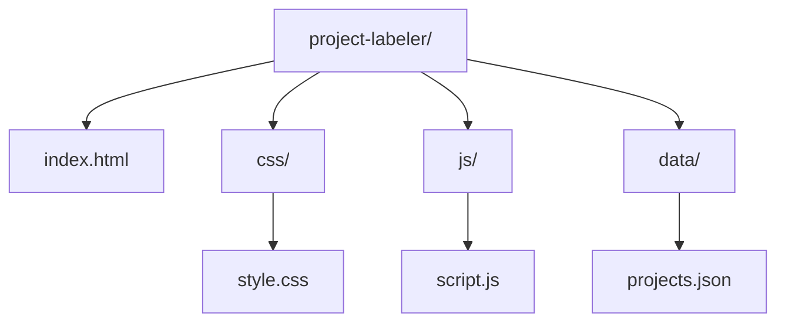

# Architectural Plan: Project-User Labeling Application

## 1. Application Overview:
The application will be a single-page web interface allowing users to input project names and associate them with usernames. It will provide functionalities to add new entries, view existing entries, and potentially edit/delete them. The interface will be minimalistic and user-friendly.

## 2. Technology Stack:
*   **Frontend:**
    *   **HTML5:** For structuring the content and defining the application's layout.
    *   **CSS3:** For styling the application, ensuring a clean and intuitive user interface.
    *   **JavaScript (ES6+):** For all interactive functionalities, including data manipulation, DOM updates, and data persistence. No external frameworks or libraries will be used to keep it simple.

## 3. File Structure:
The project will be organized within a dedicated `project-labeler/` directory to maintain a clean workspace.



*   [`[WORKFLOW_CONFIG_ROOT]/project-labeler/index.html`](project-labeler/index.html): The main HTML file, serving as the single page of the application. It will include links to the CSS and JavaScript files.
*   [`[WORKFLOW_CONFIG_ROOT]/project-labeler/css/style.css`](project-labeler/css/style.css): Contains all the CSS rules for styling the application.
*   [`[WORKFLOW_CONFIG_ROOT]/project-labeler/js/script.js`](project-labeler/js/script.js): Contains all the JavaScript logic for handling user interactions, managing data, and updating the DOM.
*   [`[WORKFLOW_CONFIG_ROOT]/project-labeler/data/projects.json`](project-labeler/data/projects.json): (Optional, see Data Storage) A JSON file to store the project-username associations if `localStorage` is not used or a persistent file-based storage is preferred for initial data loading or backup.

## 4. Data Storage Strategy:
Given the requirement for simplicity and a single-page application, `localStorage` is the preferred method for data persistence within the browser.

*   **Primary Storage: Browser `localStorage`**
    *   **Mechanism:** JavaScript will store and retrieve a JSON string representing the project-username data directly in the user's browser `localStorage`.
    *   **Data Structure:** The data will be stored as an array of objects, where each object represents a project-username pair.
        ```json
        [
            {
                "project": "Project Alpha",
                "username": "user123"
            },
            {
                "project": "Project Beta",
                "username": "insid30ut"
            }
        ]
        ```
    *   **Advantages:**
        *   **Simplicity:** No server-side component or complex database setup is required.
        *   **Offline Access:** Data is immediately available even if the user is offline.
        *   **Client-Side Persistence:** Data persists across browser sessions for the same user on the same browser.
    *   **Considerations:**
        *   **Storage Limits:** `localStorage` has a limit (typically 5-10 MB), which is more than sufficient for this application's scope.
        *   **Security:** Data is client-side and not encrypted by default; sensitive information should not be stored here. For this application, project names and usernames are not considered highly sensitive.
        *   **Browser Specific:** Data is tied to the specific browser and origin (domain). It won't sync across different browsers or devices.

*   **Alternative/Supplemental Storage: JSON File (`projects.json`)**
    *   **Mechanism:** If a file-based approach is desired (e.g., for initial seeding of data or easier inspection outside the browser's developer tools), the `projects.json` file could be used.
    *   **Implementation:** JavaScript would fetch this file on application load (e.g., using `fetch` API) to initialize the data, and then continue to use `localStorage` for runtime modifications. Direct writing back to the `projects.json` file from the client-side JavaScript is not feasible without a server-side component.
    *   **Decision:** For this simple application, `localStorage` is sufficient and avoids the need for a server component to manage file writes. The `projects.json` file will be included as a placeholder for potential future enhancements or manual data seeding, but `localStorage` will be the primary operational storage.

## 5. Core Functionalities:
*   **Add Entry:** A form with input fields for "Project Name" and "Username" and an "Add" button. On submission, the data is validated, added to the JavaScript data structure, updated in `localStorage`, and the UI is refreshed.
*   **Display Entries:** A table or list to display all stored project-username associations.
*   **Edit/Delete Entry:** (Future enhancement) Buttons next to each entry to allow modification or removal.